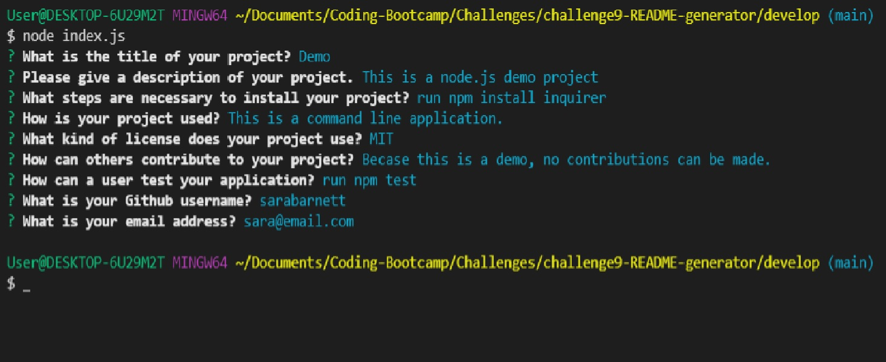
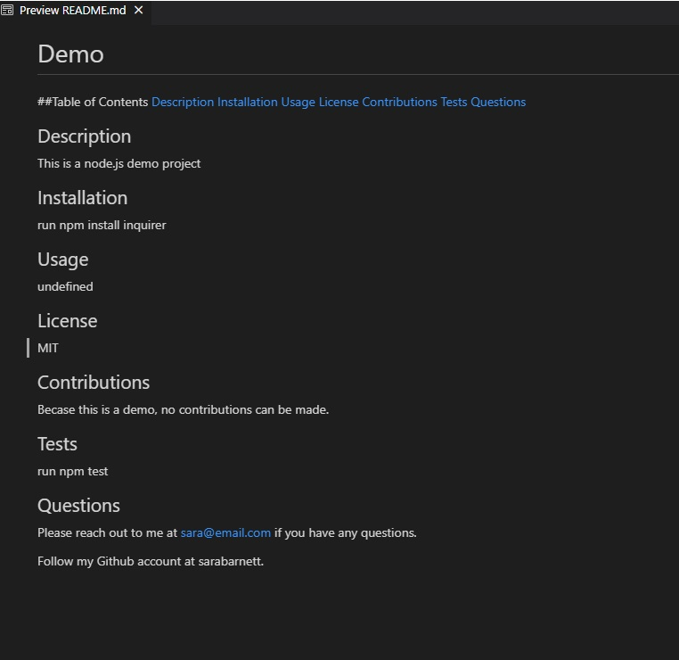

# Professional README Generator

## Description
This project is a professional README generator command line application. It utilizes Inquirer to prompt users for Title, Description, Installation, Usage, Contributing, and Test and Contact information.  The user input is then converted into a new README.md file complete with a Table of Contents and links to corresponding sections.

## Installation
Use the command 'npm install inquirer' to install the necessary dependencies and to be able to use the application.

## Usage
Please refer to the following video demo to see how the app can be used.

## Screenshot
Below is a screenshot of the command-line prompts as well as the generated README file.

## Collaborators
Beyond the started code given, all code was written by Sara Barnett.